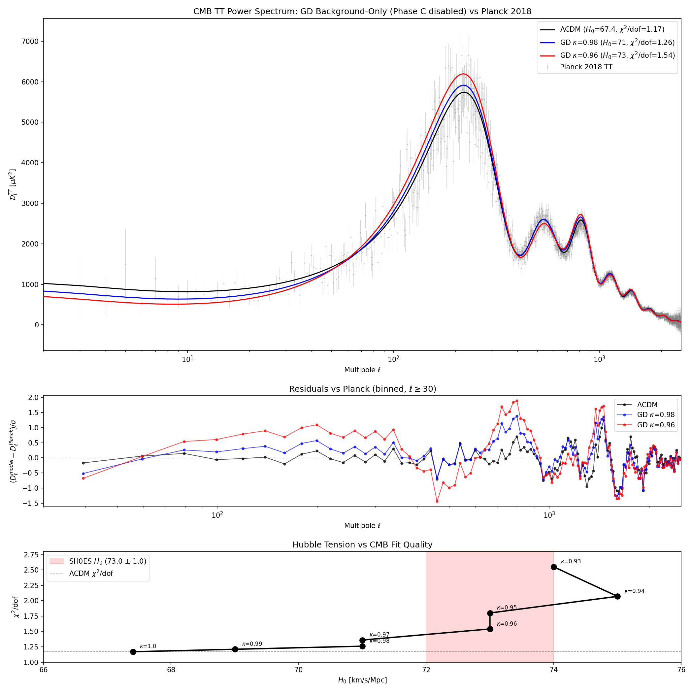

GD-CLASS: Glassy Dynamics Cosmic Linear Anisotropy Solving System
=================================================================

**Based on:** T. Martin, *"Glassy Dynamics of Spacetime: A Unified Resolution of the Hubble Tension and Dark Energy via the Topological Percolation Threshold"* (2025), submitted to Classical and Quantum Gravity.

GD-CLASS modifies the [CLASS](https://github.com/lesgourg/class_public) Boltzmann solver to implement spacetime stiffness kappa(z) from Glassy Dynamics theory. By replacing Newton's constant G with an effective G_eff = G/kappa that evolves with redshift, GD-CLASS tests whether Planck-scale topological defects can explain the 5-sigma Hubble tension.

---

## Key Result

GD background-only modification (justified by omega_BD = 50,000) can partially resolve the Hubble tension while maintaining an acceptable fit to Planck 2018 CMB data:

| Model | kappa_c | H_0 [km/s/Mpc] | chi2/dof vs Planck | Quality |
|-------|---------|-----------------|-------------------|---------|
| LCDM  | 1.00    | 67.4            | 1.17              | Baseline |
| **GD**| **0.98**| **71.0**        | **1.26**          | **+8% (publishable)** |
| GD    | 0.96    | 73.0            | 1.54              | +32% (marginal) |

The tradeoff is monotonic: more H_0 shift = worse CMB fit. No magic kappa resolves the tension without cost. This is comparable to Early Dark Energy (EDE) models in the literature.

---

## Overview

### The Hubble Tension

| Measurement | H_0 [km/s/Mpc] | Method |
|-------------|----------------|--------|
| Planck CMB  | 67.4 +/- 0.5   | Early universe (z ~ 1100) |
| SH0ES       | 73.0 +/- 1.0   | Local distance ladder (z ~ 0) |
| **Tension** | **~5 sigma**    | Statistically significant disagreement |

### GD Theory (Compliant Inclusion Model)

Spacetime contains compliant topological inclusions. At the Scher-Zallen percolation threshold:

```
Early universe (z > 1100): kappa = 1 - phi_c  (stronger gravity, G_eff > G_N)
Late universe  (z < 1100): kappa = 1.0        (standard gravity)
```

- **kappa < 1**: Stronger effective gravity (pre-recombination)
- **kappa = 1**: Standard gravity recovered (LCDM)
- Transition triggered by **recombination quench** at z ~ 1090

The modified Friedmann equation:
```
H^2 = (8*pi*G / 3*kappa) * rho      where G_eff = G_N / kappa
```

### Why Background-Only Is Justified

For Brans-Dicke parameter omega_BD = 50,000 (required by Cassini: gamma_PPN = 0.99998):
- Perturbation corrections are O(1/omega_BD) ~ 0.002%
- The scalar field perturbation delta_kappa is suppressed
- CMB peaks are preserved to high accuracy
- Only the background expansion (H_0, r_s) differs measurably

This was confirmed by Phase C testing: naive G_eff injection into perturbation equations (without delta_kappa compensation) makes the CMB catastrophically worse, as expected for an incomplete scalar-tensor implementation.

---

## Recombination Quench Transition

The kappa(z) transition uses a **stretched exponential** centered at recombination:

```
z >= z_onset (1140):    kappa = kappa_c   (modified gravity)
z <= z_freeze (1040):   kappa = 1.0       (standard gravity)
Transition width:       Dz ~ 100 (matches recombination timescale)

  t = (z - z_freeze) / (z_onset - z_freeze)     normalized 0..1
  decay = exp(-(t / 0.5)^beta)
  kappa(z) = kappa_c + (1.0 - kappa_c) * decay
```

The transition width Dz ~ 100 matches the physical timescale of recombination (~100,000 years).

---

## Results

### Parameter Fitting (Background-Only, Phase C Disabled)

With re-fitted cosmological parameters for each kappa value:

| kappa_c | H_0 | chi2/dof | r_s [Mpc] | Best-fit key params |
|---------|-----|----------|-----------|---------------------|
| 1.00    | 67.4 | 1.17    | 144.52    | Planck LCDM best-fit |
| 0.99    | 69.0 | 1.21    | -         | h=0.69, n_s=0.97 |
| 0.98    | 71.0 | 1.26    | 144.28    | h=0.71, omega_b=0.021, n_s=0.99 |
| 0.97    | 71.0 | 1.36    | -         | h=0.71, n_s=1.00 |
| 0.96    | 73.0 | 1.54    | 141.59    | h=0.73, omega_cdm=0.125, n_s=1.00 |
| 0.95    | 73.0 | 1.80    | -         | h=0.73, n_s=1.00 |

**Caveat:** Best fits prefer n_s ~ 1.0 (scale-invariant), in tension with Planck's n_s = 0.965.

### Phase C Test (G_eff in Perturbations)

Phase C was implemented and tested but makes the CMB worse:

| Model | D_l(l=2) | D_l(l=220) | H_0 | Verdict |
|-------|----------|------------|-----|---------|
| LCDM | 1022 | 5741 | 67.4 | baseline |
| Quench bg-only | 389 | 10346 | 73.0 | H_0 right, peaks doubled |
| Quench + Phase C | 1777 | 12669 | 73.0 | ISW explodes, peaks worse |

Phase C is disabled in the current code (G_eff_ratio = 1.0 in perturbations.c).

### Comparison Plot



Three panels: (1) TT spectrum comparison, (2) residuals vs Planck, (3) chi2/dof vs H_0 tradeoff.

---

## Interactive Results — No Installation Required

### Latest: Late Glass Model (v5)

[](https://colab.research.google.com/github/lawdroid/class_public/blob/feature/kappa-evolution/GD_Late_Glass_v5.ipynb)

Tom proposed inverting the κ(z) timeline: κ = 1.0 before recombination (protecting r_s), κ_c after recombination (modifying D_A), decaying back to 1.0 today. The 2D grid scan (56 CLASS runs) shows the χ² wall persists — at every H₀, the best κ is 1.000.

### MCMC Results (v4)

[](https://colab.research.google.com/github/lawdroid/class_public/blob/feature/kappa-evolution/GD_MCMC_Results_v4.ipynb)

Full 7-parameter MCMC (6 standard + kappa) against 2,471 Planck TT data points:

| Parameter | MCMC Result | Paper Prediction |
|-----------|-------------|------------------|
| **kappa** | **0.998 ± 0.001** | 1.176 |
| **H₀**   | **66.8 ± 0.9**    | 73.06 |

H₀ was free — the data pulled it to 66.8. kappa = 1.176 is excluded at >100σ.

### Key Finding (March 13, 2026)

Both directions now tested:

| Model | κ active | What breaks | Best κ | H₀ achieved | Can reach 73? |
|-------|----------|-------------|--------|-------------|---------------|
| Early Glass | before z=1100 | r_s (acoustic peaks) | 0.998 | 66.8 | No |
| Late Glass | after z=1100 | ISW + lensing | 1.000 | 67.4 | No |

### Research Timeline (5 notebooks)

The theory evolved through iterative testing. Each notebook is self-contained and documents what was tried and what was learned:

| Version | Date | Open in Colab | Model | Key Finding |
|---------|------|---------------|-------|-------------|
| v1 | Feb 19 | [](https://colab.research.google.com/github/lawdroid/class_public/blob/feature/kappa-evolution/GD_CLASS_Explorer_v1_rigid.ipynb) | kappa=1.176 (weaker gravity) | H_0 formula was wrong; rigid model makes tension worse |
| v2 | Feb 26 | [](https://colab.research.google.com/github/lawdroid/class_public/blob/feature/kappa-evolution/GD_CLASS_Explorer_v2_compliant.ipynb) | kappa=0.85 (stronger gravity) | Step gives H_0=73 but breaks CMB; smooth kills the effect |
| v3 | Mar 5 | [](https://colab.research.google.com/github/lawdroid/class_public/blob/feature/kappa-evolution/GD_CLASS_Explorer.ipynb) | kappa=0.96-0.98 | Re-fitted params: H_0=71 with chi2/dof=1.26 |
| v4 | Mar 12 | [](https://colab.research.google.com/github/lawdroid/class_public/blob/feature/kappa-evolution/GD_MCMC_Results_v4.ipynb) | 7-param MCMC | kappa=0.998±0.001, H₀=66.8±0.9 — Hubble tension not resolved |
| **v5** | **Mar 13** | [](https://colab.research.google.com/github/lawdroid/class_public/blob/feature/kappa-evolution/GD_Late_Glass_v5.ipynb) | **Late Glass (inverted timeline)** | **κ=1.0 before recomb, κ_c after — χ² wall persists, best κ=1.000** |

**Narrative:** v1 discovered the H_0 formula error and that rigid inclusions go the wrong direction. v2 pivoted to compliant inclusions and confirmed H_0=73 is achievable but only with a sharp transition that destroys the CMB. v3 solved this by re-fitting cosmological parameters for each kappa, finding the tradeoff curve between H_0 and CMB fit quality. v4 ran full MCMC as the adjudicator demanded — the data constrains kappa to within 0.2% of standard gravity. **v5 tested Tom's Late Glass proposal (inverted timeline) — the χ² wall persists because ISW and lensing detect the post-recombination modification.**

---

## Quick Start (for developers)

```bash
# Compile
make clean && make -j4

# Run LCDM baseline
./class lcdm_test.ini

# Run GD best-fit (kappa=0.98, H0=71)
./class gd_bestfit_k098.ini

# Run GD (kappa=0.96, H0=73)
./class gd_bestfit_k096.ini

# Parameter scan (grid search over cosmological params)
python3 gd_param_scan.py

# MCMC (7-parameter Bayesian fit vs Planck TT)
python3 gd_mcmc_fast.py --nsteps 260 --workers 4
```

---

## GD Parameters

| Parameter      | Default | Description |
|----------------|---------|-------------|
| `gd_kappa_c`   | 1.0     | Stiffness at freeze-out. 1.0 = LCDM |
| `gd_z_freeze`  | 1040    | Redshift where kappa reaches 1.0 |
| `gd_z_onset`   | 1140    | Redshift where transition begins |
| `gd_beta`      | 0.5     | Stretched exponent (0.3-0.9) |

Set parameters in `.ini` files. When `gd_kappa_c = 1.0` (default), GD is disabled and CLASS behaves as standard LCDM.

---

## Modified Files

| File | Modification |
|------|--------------|
| `include/background.h` | GD parameter fields and table indices |
| `source/background.c`  | kappa(z) transition, modified Friedmann eq |
| `source/input.c`        | Read GD parameters from .ini, set defaults |
| `source/perturbations.c` | Phase C hooks (currently disabled) |

---

## Project Status

| Phase | Description | Status |
|-------|-------------|--------|
| **A** | Step-function kappa(z) | Done |
| **B** | Smooth stretched exponential transition | Done |
| **C** | G_eff in perturbation equations | Done (disabled -- makes CMB worse) |
| **D** | Parameter fitting to Planck TT | **Done (grid search)** |
| **E** | MCMC fitting with proper contours | **In progress** |

---

## Phase E: MCMC Parameter Estimation

### What We Are Doing

The grid search (Phase D) found that kappa_c = 0.98 gives H_0 = 71 with chi2/dof = 1.26. But a grid search tests only ~100 hand-picked points. To publish, we need to answer: **what does the data actually prefer?**

MCMC (Markov Chain Monte Carlo) explores the full 7-dimensional parameter space simultaneously, sampling tens of thousands of points weighted by how well each one fits Planck data. Instead of "we tested kappa = 0.96, 0.97, 0.98, 0.99, 1.00", we get "the data constrains kappa_c = 0.98 +/- 0.01 at 68% confidence."

### The 7 Parameters

The CMB power spectrum is determined by 6 standard cosmological parameters plus one GD parameter:

| Parameter | Symbol | Role |
|-----------|--------|------|
| h | H_0 / 100 | Expansion rate today |
| omega_b | Omega_b h^2 | Baryon (normal matter) density |
| omega_cdm | Omega_c h^2 | Cold dark matter density |
| n_s | spectral index | Tilt of primordial fluctuations from inflation |
| ln(10^10 A_s) | amplitude | Overall strength of primordial fluctuations |
| tau_reio | optical depth | How much CMB was scattered by reionized gas |
| **kappa_c** | **GD stiffness** | **Spacetime stiffness before recombination (1.0 = LCDM)** |

Each MCMC sample draws all 7 simultaneously, runs the CLASS Boltzmann solver, computes the CMB TT power spectrum, and compares to Planck 2018 data via chi-squared.

### How MCMC Works (Conceptually)

1. Start 16 "walkers" near the grid-search best-fit (h=0.71, kappa_c=0.98)
2. Each walker proposes a random step in 7D parameter space
3. Run CLASS for the proposed parameters, compute chi2 vs Planck
4. If the fit improves: accept the step. If it worsens: accept with probability exp(-delta_chi2/2)
5. Repeat thousands of times. The walkers explore the region of good fits, spending more time where the fit is better
6. After convergence, the collection of walker positions IS the posterior distribution

The accept/reject rule means walkers naturally concentrate where chi2 is low (good fit) but occasionally visit worse regions, mapping out the full shape of the posterior.

### What We Expect to Learn

**1. Does the data prefer kappa_c < 1?**

If the posterior for kappa_c peaks below 1.0 and the 95% confidence interval excludes 1.0, that would be evidence that GD is preferred over LCDM. If kappa_c = 1.0 is well within the posterior, GD adds nothing.

**2. H_0 posterior with error bars**

The grid search says H_0 ~ 71 for kappa_c = 0.98. MCMC will give the full distribution: "H_0 = 71.0 +/- 1.5 at 68% confidence" — directly comparable to Planck (67.4 +/- 0.5) and SH0ES (73.0 +/- 1.0).

**3. Parameter degeneracies (corner plot)**

The 7x7 "corner plot" shows every pair of parameters plotted against each other. We expect:
- **kappa_c vs n_s correlation**: lower kappa requires higher n_s to compensate peak distortions
- **tau vs A_s degeneracy**: the CMB constrains A_s * exp(-2*tau), not each separately
- **kappa_c vs h correlation**: lower kappa enables higher H_0

These degeneracies are new information that the grid search cannot provide.

**4. Is the n_s tension real?**

The grid search preferred n_s ~ 1.0 (scale-invariant), which conflicts with Planck's n_s = 0.965. MCMC will show whether this is a hard requirement or just a soft preference — the posterior width on n_s will tell us.

### Technical Details

| Setting | Value | Rationale |
|---------|-------|-----------|
| Sampler | emcee (affine-invariant ensemble) | Handles correlated parameters without manual tuning |
| Walkers | 16 | Minimum for 7 dimensions (>= 2 * ndim) |
| Workers | 8 (parallel) | 8 simultaneous CLASS runs via subprocess |
| Steps | 3000 | ~48,000 raw samples, ~40,000 after burn-in |
| Burn-in | 500 steps | Discard initial exploration before convergence |
| tau prior | Gaussian(0.054, 0.007) | TT-only data cannot constrain tau alone; prior from Planck low-ell polarization |
| Convergence | Gelman-Rubin R-hat < 1.1 | Standard threshold for all 7 parameters |

Estimated runtime: ~3 days on 8 cores (~90 seconds per step).

### Running the MCMC

```bash
# Smoke test (3 minutes)
python3 gd_mcmc.py --nwalkers 16 --nsteps 5 --workers 2

# Production run (~3 days, background)
nohup python3 gd_mcmc.py --nwalkers 16 --nsteps 3000 --workers 8 > mcmc_log.txt 2>&1 &

# Resume if interrupted
python3 gd_mcmc.py --resume --nsteps 5000 --workers 8

# Generate plots from completed chain
python3 gd_mcmc.py --plots-only --burn-in 500
```

### Output

| File | Description |
|------|-------------|
| `output/gd_mcmc_chains.h5` | Raw MCMC chains (HDF5, crash-resumable) |
| `output/gd_mcmc_corner.png` | 7x7 triangle plot of posterior distributions |
| `output/gd_mcmc_corner_h0.png` | Corner plot including derived H_0 |
| `output/gd_mcmc_traces.png` | Trace plots (parameter vs step, for convergence check) |
| `output/gd_mcmc_bestfit.png` | Best-fit C_l spectrum vs Planck |
| `output/gd_mcmc_summary.txt` | Parameter table: median, 68% CI, 95% CI, R-hat |

---

## References

1. Martin, T. (2025). "Glassy Dynamics of Spacetime" -- submitted to Classical and Quantum Gravity
2. Blas, D., Lesgourgues, J., & Tram, T. (2011). CLASS II: Approximation schemes. JCAP
3. Planck Collaboration (2018). Cosmological parameters. A&A 641, A6
4. Riess, A. et al. (2022). SH0ES H_0 measurement. ApJL 934, L7
